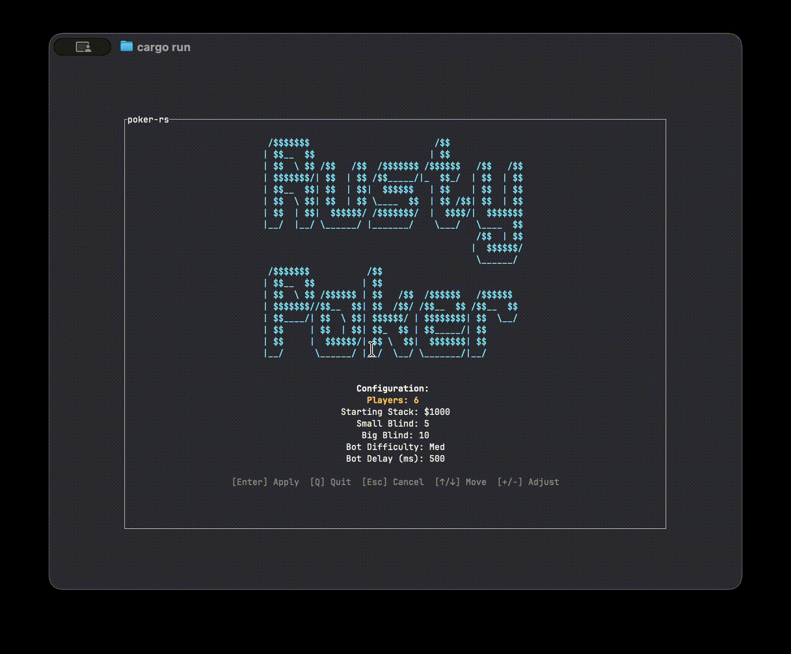

# poker-rs

High-performance poker hand evaluation library written in Rust with a Ratatui TUI for playing No-Limit Texas Hold'em.



## Highlights

- Deterministic evaluator for Texas Hold'em with a small public API.
- Playable TUI with human and bot agents.
- Clean separation between library logic and UI.
- Property-based tests and Criterion benches included.

## Quick Start (TUI)

```sh
cargo run --bin poker-rs
```

Use `?` in the app for the in-game help.

## Library Usage

```rust
use poker_rs::cards::{Card, Rank, Suit};
use poker_rs::evaluator::{evaluate_holdem, Category};
use poker_rs::hand::{Board, HoleCards};

let hole = HoleCards::try_new(
    Card::new(Rank::Ace, Suit::Spades),
    Card::new(Rank::Ace, Suit::Hearts),
).unwrap();
let board = Board::try_new(vec![
    Card::new(Rank::King, Suit::Clubs),
    Card::new(Rank::Queen, Suit::Diamonds),
    Card::new(Rank::Jack, Suit::Hearts),
    Card::new(Rank::Three, Suit::Spades),
    Card::new(Rank::Two, Suit::Clubs),
]).unwrap();

let eval = evaluate_holdem(&hole, &board).unwrap();
assert_eq!(eval.category, Category::Pair);
```

## Project Layout

- `src/lib.rs`: library crate entry point.
- `src/bin/poker.rs`: TUI binary.
- `src/cards`: card representation and parsing.
- `src/hand`: hole cards + board validation.
- `src/evaluator`: ranking and comparisons.
- `src/engine`: No-Limit Hold'em game engine.
- `src/agents`: bot/human agent interfaces.
- `src/tui`: Ratatui views, state, and input.
- `benches`: Criterion benchmarks.
- `tests`: integration tests.

## Development

```sh
cargo fmt --all
cargo clippy --all-targets --all-features -- -D warnings
cargo test --all
```
